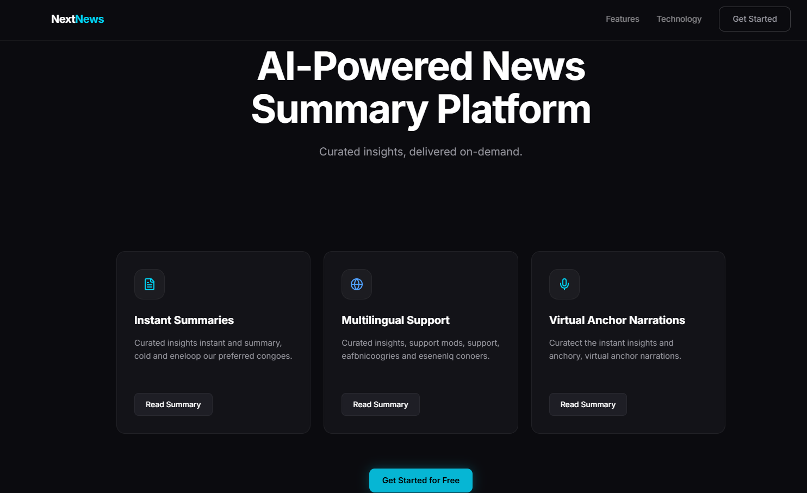
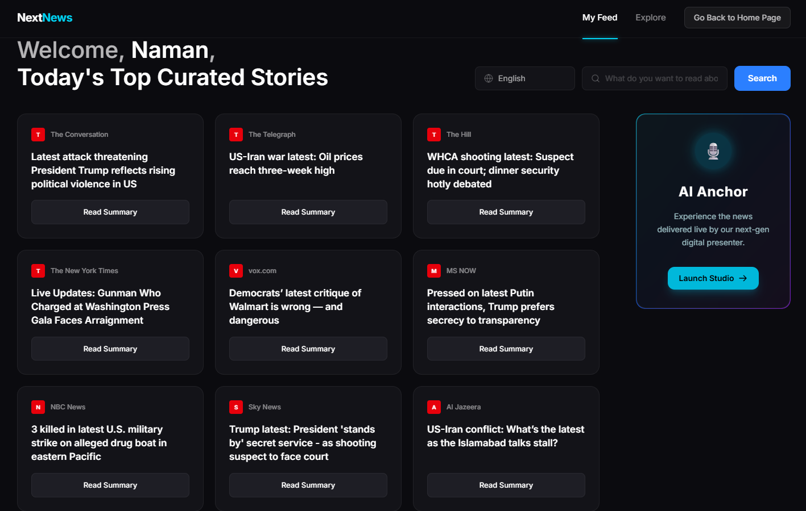
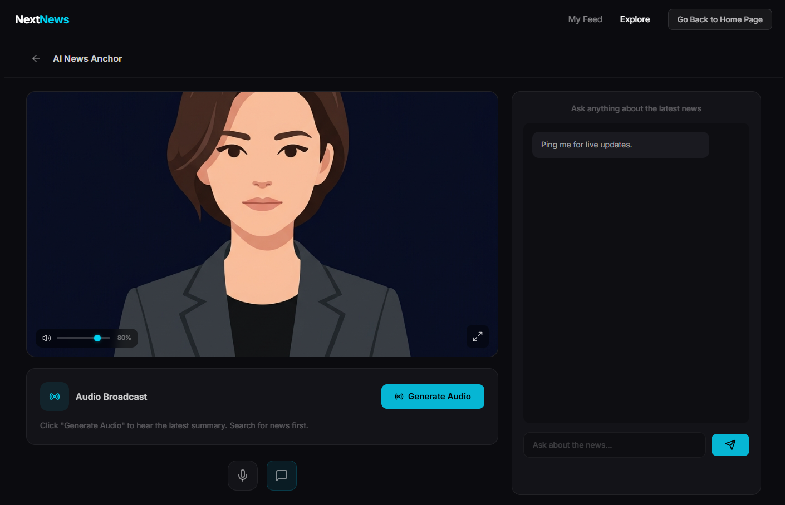

# NextNews
## Intelligent News Aggregation and Analysis Platform

A comprehensive platform that leverages artificial intelligence to analyze, categorize, and deliver personalized news content. This repository contains both frontend and backend components for a modern news application that uses natural language processing to enhance the news consumption experience.

## Project Overview

NextNews is designed to transform how users interact with news content by applying advanced AI techniques to:

- Aggregate news from multiple reliable sources
- Analyze sentiment and context in news articles
- Provide personalized news recommendations
- Visualize trends and patterns in news coverage
- Deliver real-time breaking news alerts

The project is structured with separate frontend (NextNews) and backend components, following modern web development architecture practices.

## Repository Structure

This repository is organized into the following main directories:

- **NextNews**: Frontend interface built with JavaScript, using Next.js framework
- **backend**: Python-based backend services for data processing and AI analysis

## Technology Stack

### Frontend 
- React.js for the user interface
- Modern JavaScript frameworks for interactive visualizations
- Responsive design for cross-device compatibility

### Backend 
- Python-based API services
- Natural Language Processing (NLP) algorithms
- News data aggregation and processing systems
- AI/ML models for content analysis

## Getting Started

### Prerequisites

- React.js 
- Python (3.8 or later)
- Git

3

## Features

- **News Aggregation**: Collects articles from diverse sources
- **Sentiment Analysis**: Identifies emotional tone and bias in reporting
- **Topic Classification**: Categorizes news into relevant topics
- **Personalized Feed**: Tailors content to user preferences
- **Search Capabilities**: Finds relevant articles across sources
- **Visualization Tools**: Presents news trends graphically

## Development

This project follows a modular development approach with:

- Separation of frontend and backend concerns
- RESTful API architecture
- Data processing pipelines for news content
- AI model integration for advanced analysis

## Acknowledgments

- News data providers
- Open-source NLP libraries
- AI research community
- Contributors and testers

